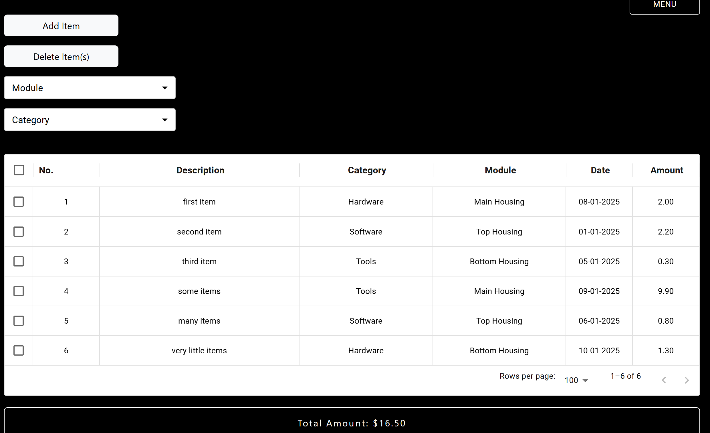
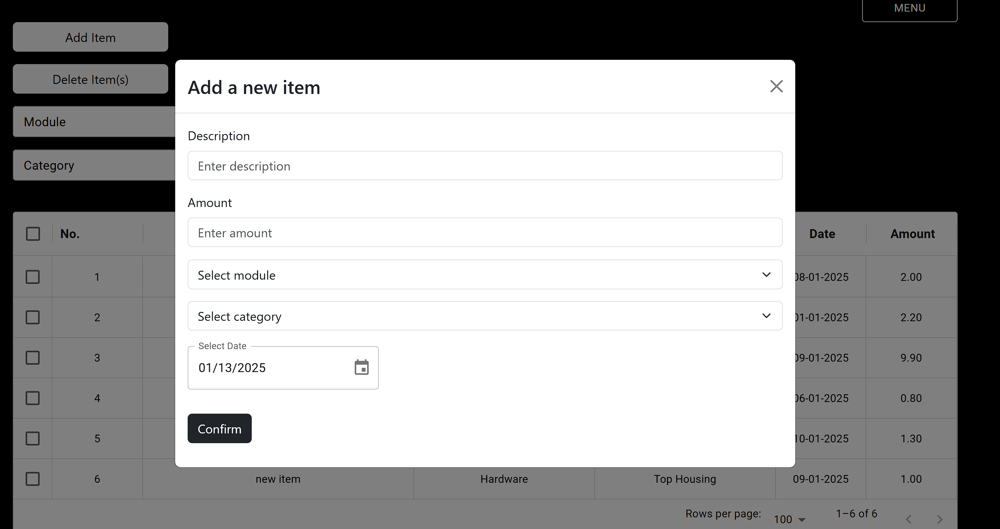
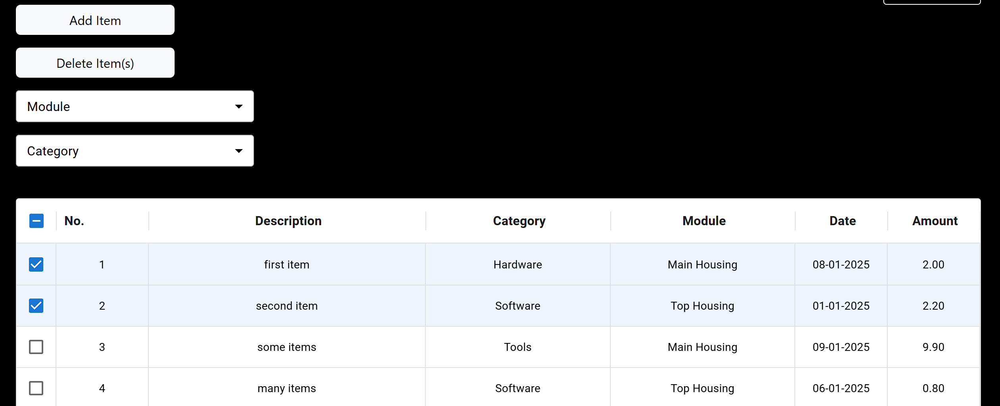
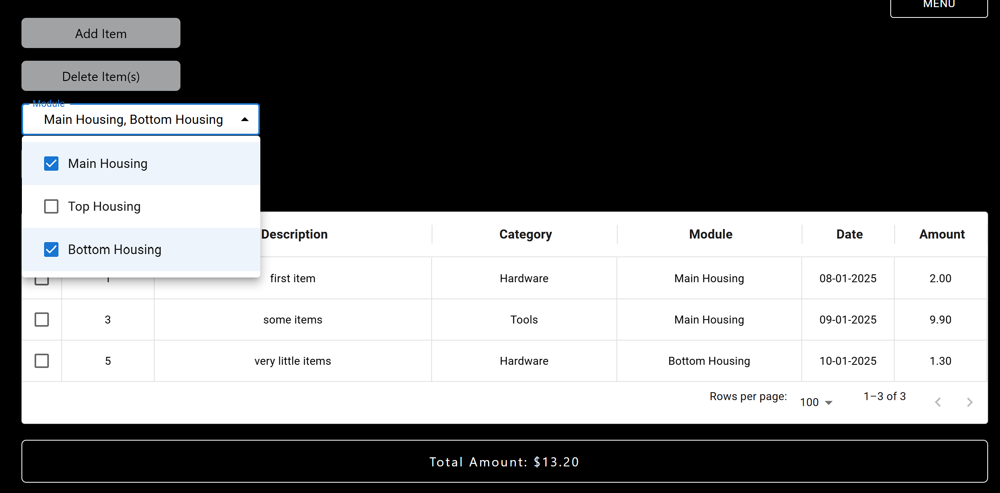
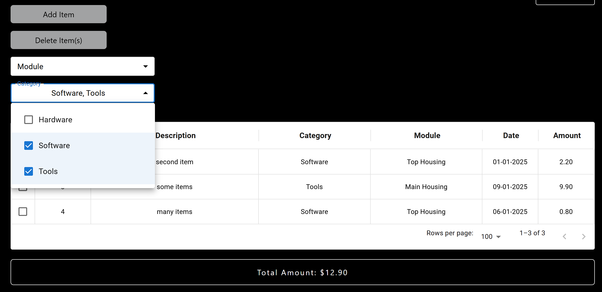
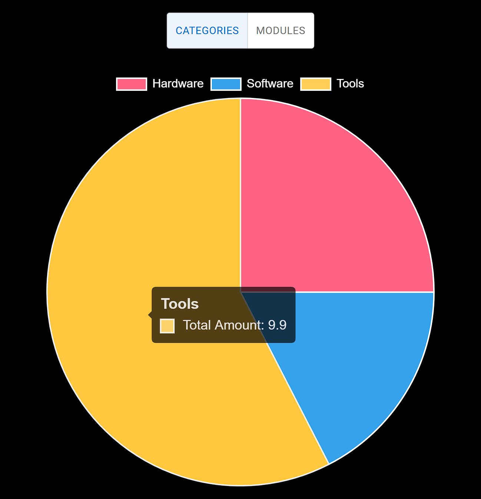
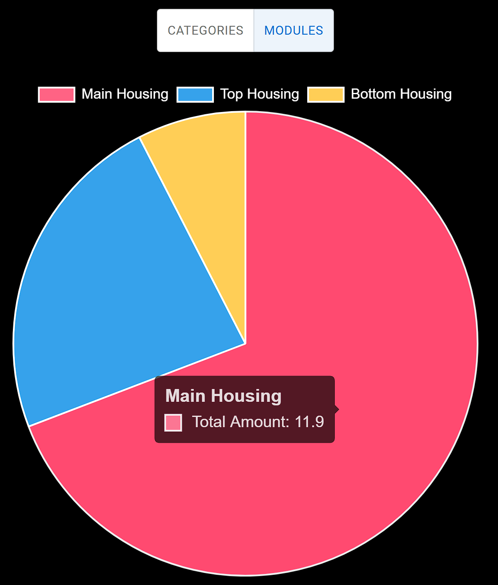
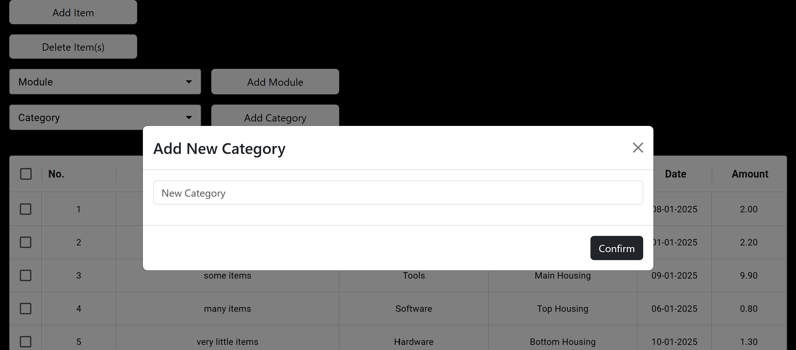
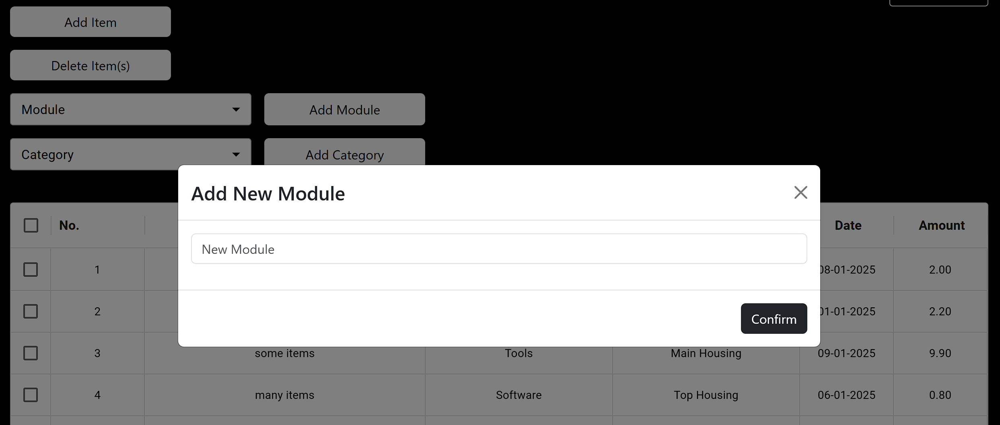

# Bred User Guide  
Bred is the ultimate financial management platform for your organization, designed to streamline expense tracking across projects, visualize spending patterns with dynamic charts, and provide actionable insights to make data-driven decisions effortlessly.

## Overview of Features  
1. add a new row of data (description, category, module, amount, date added).
2. delete row(s) of data.
3. filter data by modules.
4. filter data by categories.
5. view piecharts.
6. add new categories.
7. add new modules.

## Add New Row  
Add a new row of data to the table in the main dashboard.
- to add a new row of data, click on the `Add Item` button.
- a modal form will pop up requiring you to fill in details about the new row of data.
- the details include the description, amount, category, module, and date added. (all fields are required)
- the amount only accepts values up to 2 decimal places, some examples of valid inputs include: 1.0, 2.00, .03, 3

## Delete Row(s)  
Remove a row of data from the table in the main dashboard.  
- to remove a row of data, select the row that you want to delete and click on the `Delete Item(s)` button.
- to remove multiple rows of data, select all the rows that you want to delete, then click on the `Delete Item(s)` button.
- after the selected row(s) have been deleted, the indices of the remaining items will be updated.

## Filter By Modules  
Filter the table of data by specific module(s).
- click on the `Module` button to trigger the dropdown menu. 
- from the dropdown menu, select the module(s) that you would like to filter.
- the table will update with data belonging to the module(s) selected. 
- the total amount will also be updated, with the total amount of the items belonging to the module(s) selected.  

## Filter By Categories  
Filter the table of data by specific category(s).  
- click on the `Category` button to trigger the dropdown menu. 
- from the dropdown menu, select the category(s) that you would like to filter.
- the table will update with data belonging to the category(s) selected. 
- the total amount will also be updated, with the total amount of the items belonging to the category(s) selected.  

## View Chart Analysis  
View the piecharts that represent the graphical visualisation of the table data.  
- click on the `Menu` button on the top right corner to open the menu.
- the menu should display `Dashboard`, which is the default page and the page where the table data lies, and `Charts`, which displays the piecharts for the categories and modules.
- to view the piechart for the categories, click on  the toggle button to toggle to `Categories`.
- to view the piechart for the modules, click on the toggle button to toggle to `Modules`.

    
    

## Add New Categories  
Add new categories to the existing list of categories.  
- to add a new category to the existing list of categories, click on the `Add Category` button.
- a modal will pop up and you will be required to fill in the name of the new category.
- click on `Confirm` to save the new category to the existing list.

## Add New Modules   
Add new modules to the existing list of modules.  
- to add a new module to the existing list of modules, click on the `Add Module` button.
- a modal will pop up and you will be required to fill in the name of the new module.  
- click on `Confirm` to save the new module to the existing list.

## Additional Notes  
Bred was started as a side project to learn more about using React and Express to build dynamic and interactive webpages. It is by no means a commercial product and should not be used for any commercial purposes (if you do make money however, rmb to buy me a cup of coffee!).